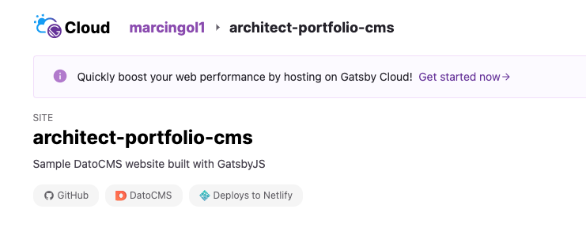
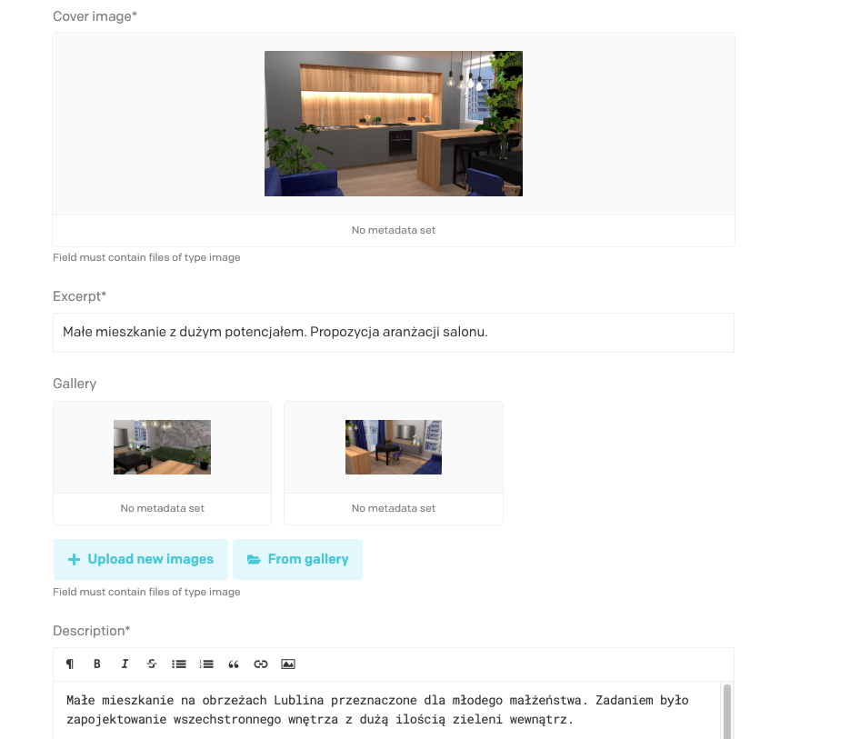

# Architect portfolio.

# Application uses:

- ## Netlify deployment for DNS resolving for custom domain
  
- ## Gatsby Cloud for seamless integration with Gatsby application and DatoCMS
  
- ## DatoCMS for managing content within application without need to deploy
  

All of that provide free template for mantaining robust solution with only cost of a domain.

## To view site online, visit: https://architektgol.pl/

Created from official Gatsby template as a base.
This repo contains a static website written with [GatsbyJS](https://www.gatsbyjs.org/), integrated with content coming from [DatoCMS](https://www.datocms.com).
